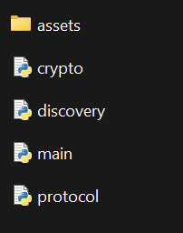
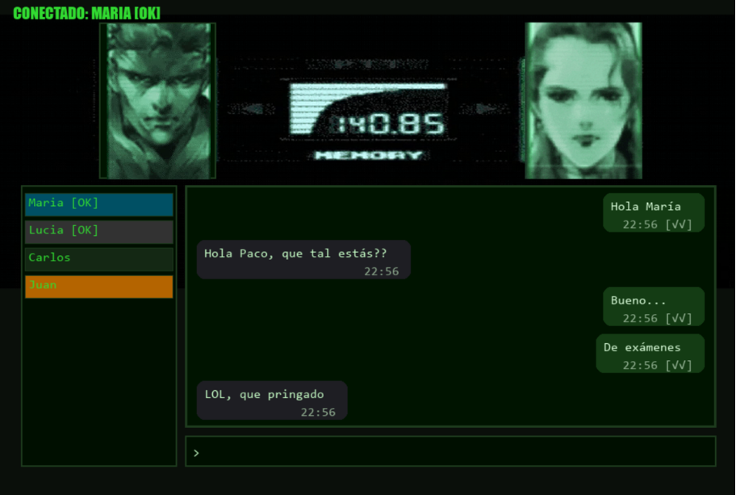

# Instant Messaging App

<p align="center">
  
</p>

> Este proyecto es una aplicación de mensajería P2P cifrado extremo-a-extremo, que garantiza la identidad real de los usuarios mediante verificación con DNIe. Está diseñada con una interfaz retro inspirada en el sistema CODEC de Metal Gear Solid.

---

## ✨ Características Principales
* 🔐 Autenticación Fuerte con DNIe: Verifica la identidad real del contacto extrayendo el Common Name (CN) del certificado digital y validando la firma criptográfica en tiempo real.

* 🛡️ **Cifrado de Extremo a Extremo:** Utiliza un protocolo de intercambio de claves basado en X25519 y cifrado simétrico ChaCha20Poly1305 para todos los mensajes.

* 📡 **Descubrimiento Automático (ZeroConf):** Detecta automáticamente otros usuarios en la red local sin necesidad de configurar IPs manualmente.

* 💾 **Persistencia Segura:** El historial de chat y las sesiones se guardan en disco cifrados con una clave maestra derivada de tu DNIe. Solo tú puedes desbloquear el historial.

* 🎮 **Interfaz Retro (MGS Codec):**
  
   - Animaciones de personajes al hablar.
  
   - Sonidos de notificación (llamada, apertura de canal).
  
   - Feedback visual de estado (En cola, Enviado, Recibido, Leído).

## 🛠️ Requisitos del sistema:

Para ejecutar el proyecto necesitas:

* **Hardware**
  - Lector de tarjetas inteligente conmpatible.
  - DNIe activo y con certificados en vigor. 

<p align="left">
  
</p>

_Lector de tarjetas y DNIe._

* **Software**
  - Python 3.8 o superior.
  - Controladores del DNIe instalados.
  - OpenSC instalado (necesario para la librería PKCS#11).
     - *Nota:* El código espera encontrar la librería en C:\Program Files\OpenSC Project\OpenSC\pkcs11\opensc-pkcs11.dll.
     - Puedes descargarlo desde [aquí](https://github.com/OpenSC/OpenSC/releases/tag/0.26.1).

---

## 🚀 Cómo probarlo

Existen dos formas de ejecutar la aplicación.

### 1. app.exe (forma rápida)

Descarga el archivo app.exe que está en la parte de Release.
Ejecutando ese archivo directamente tendremos acceso al programa sin necesidad de instalar las librerías secundarias (la librería PKCS#11 sigue siendo necesaria).


### 2. Entorno de ejecución (para ver el código en detalle y modificarlo)

También se puede clonar el repositorio con todos los programas y assets para poder personalizarlo.
Una vez tenemos el directorio con los elementos necesarios tenemos que realizar la instalación de librerías:

```bash
pip install pygame zeroconf cryptography python-pyscard pykcs11 pillow
```

<p align="left">
  
</p>

---

## 🎮 Guía de Uso

* El programa ofrece una barra lateral donde se encuentran los contactos guardados del usuario, así como otros usuarios detectados en la red a los que podemos añadir.
* Tocando sobre su nombre, se realiza la conexión y accedemos al chat.
* Para salir de los chats, se implementa el comando /leave, con el que el programa queda a la espera de que selecciones un chat para entrar.
* Aquellos contactos que estén OFFLINE, se marcan con un color gris.
* El resto de contactos, se muestran de color azul, indicando que se ha verificado su identidad mostrando su nombre real en la parte superior.
* Los contactos a los que no hemos añadido aún, pero aparecen disponibles para añadir, salen de color verde oscuro.
* Por último, si un usuario ha iniciado un handshake contigo, se notifica mediante una alerta, así como también cambia el color de su nombre a naranja.
  
<p align="center">
  
</p>
